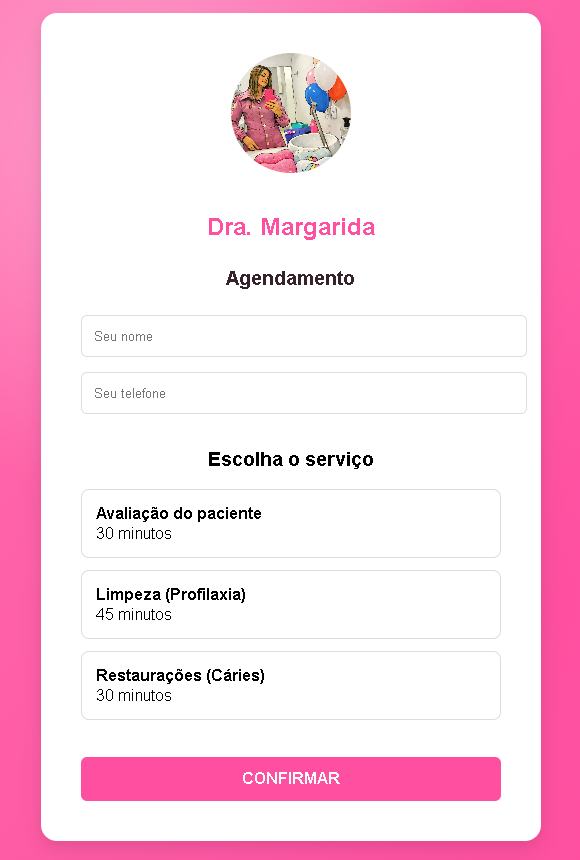
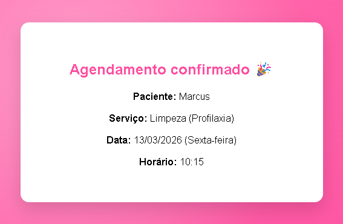

# Agendify

Agendify é um sistema de agendamento online desenvolvido para profissionais autônomos e pequenos negócios.

A aplicação permite que clientes agendem serviços de forma simples através de um link personalizado, enquanto o backend gerencia disponibilidade, horários e conflitos de agendamento.

---

## Screenshots

### Página de Agendamento



### Confirmação de Agendamento



---

## Funcionalidades
- Agendamento online por link personalizado
- Arquitetura multi-tenant baseada em slug
- Geração automática de horários disponíveis
- Bloqueio de horários já reservados
- Criação automática de clientes
- Interface simples e intuitiva
- Identidade visual personalizada por profissional

---

## Arquitetura do Projeto
O projeto é dividido em duas aplicações:

### Backend
API REST desenvolvida com:

- **FastAPI**
- **SQLModel**
- **PostgreSQL**

Responsável por:
- gerenciamento de tenants
- serviços
- disponibilidade semanal
- geração de slots
- criação de agendamentos

---

### Frontend
Interface de agendamento construída com:

- **React**
- **Vite**
- **TypeScript**

Responsável por:
- interface de agendamento
- seleção de serviço
- seleção de data e horário
- confirmação de agendamento

---

## Estrutura do Projeto
```
agendify
│
├── app
│ ├── api
│ ├── core
│ ├── db
│ ├── models
│ ├── schemas
│ ├── utils
│ └── main.py
│
├── frontend
│
├── screenshots
│
├── requirements.txt
├── .env
└── README.md
```

---

## Como Executar o Projeto
### 1. Clonar o repositório
```
git clone https://github.com/brandao-m/agendify.git
cd agendify
```

---

### 2. Backend
Criar ambiente virtual:
```
python -m venv venv
```

Ativar ambiente:
```
venv\Scripts\activate
```

Instalar dependências:
```
pip install -r requirements.txt
```

Rodar servidor:
```
uvicorn app.main:app --reload
```

---

### 3. Frontend
Entrar na pasta frontend:
```
cd frontend
```

Instalar dependências:
```
npm install
```

Rodar aplicação:
```
npm run dev
```

---

## Exemplo de uso
A aplicação suporta links personalizados:
```
http://localhost:5173/dra-margarida
```

Cada profissional possui:
- seus próprios serviços
- sua própria agenda
- sua própria identidade visual

---

## Autor
Marcus Brandão  
Backend Developer | Python | APIs REST

GitHub: https://github.com/brandao-m